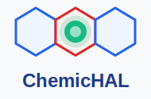

<p align="center">
  
</p>

# ChemicHAL: an XAI-enhanced agent for cheminformatics


## Overview

ChemicHAL is an **LLM-driven agent** for chemoinformatics tasks, powered by the **Model Context Protocol (MCP)** and designed for **explainable AI (XAI)**. It enables autonomous compound selectivity prediction, molecular property modeling, and interpretability through SHAP, MolAnchor, MolCE, and EdgeSHAPer.

## Prerequisites

- Python 3.12+
- `uv` package manager
- RDKit
- PyTorch
- LM Studio (for MCP integration)

## Installation

### 1. Clone and Set Up

```bash
git clone <repository-url>
cd AI-Agent-for-Compound-Prediction-and-Explainability
uv sync
```

### 2. Install LM Studio

Download **LM Studio** from [lmstudio.ai](https://lmstudio.ai) and install it on your system.

> **Note:** LM Studio has been tested as the primary MCP host. Other MCP-compatible interfaces (Ollama, Claude Desktop, etc.) may also be explored for alternative workflows.

### 3. Import MCP Server

1. Open LM Studio and navigate to **Settings** → **MCP Servers**
2. Add a new MCP server with the following configuration:
    ```json
    {
      "name": "chemagent",
      "command": "uv",
      "args": [
         "--directory",
         "<workspace-root>/src/chemagent/servers",
         "run",
         "chemagent_mcp.py"
      ]
    }
    ```
3. Update the `--directory` path to match your workspace root
4. Save and restart LM Studio

### 4. Use a Repository-Managed System Prompt (LM Studio GUI)

LM Studio GUI does not currently auto-sync a system prompt directly from a repo file.
Keep the prompt in version control and copy/paste it directly from the file.

Canonical prompt file:
- `prompts/lm_studio_system_prompt.md`

Then in LM Studio GUI:
1. Open `prompts/lm_studio_system_prompt.md` and copy the content
2. Open your chat preset (or active chat settings)
3. Paste into the System Prompt field
4. Save preset

## Agent Capabilities

🧪 **Dataset Management** – Discover, load, and preprocess ChEMBL datasets; compute molecular fingerprints (ECFP, MACCS, etc.)

🤖 **ML Modeling** – Train classification and regression models (Random Forest, SVM, XGBoost, etc.) with hyperparameter tuning

🧠 **Graph Neural Networks** – Prepare GNN datasets and train GCN/GAT models for end-to-end molecular learning with configurable depth (`num_layers`, default 4)

📊 **Visualization** – Generate classification/regression plots and model performance summaries

🔍 **Explainability (SHAP)** – Feature importance and decision boundary analysis via SHAP

🧬 **Molecular Anchors** – Identify recurrent structural motifs driving predictions with MolAnchor

🔄 **Counterfactuals** – Generate and visualize molecular modifications for explainability with MolCE

🌐 **GNN Explainability** – Explain graph predictions using EdgeSHAPer to highlight important bonds

📝 **Reporting** – Export results as HTML reports and PDF documents

<!-- ## GNN MCP Quick Start

Use this sequence for GNN workflows (without `compute_features`):

```python
# 1) Prepare graph datasets from a split + SMILES CSV
prep = prepare_gnn_dataset(
  split_file_path="session/splits/chembl_activity_data_O00329_P42336_split.pkl",
  smiles_csv_path="data/datasets/chembl_activity_data_O00329_P42336.csv",
)

# 2) Submit non-blocking GNN training
#    num_layers defaults to 4.
#    aggregation_method is optional and keeps model defaults when omitted
#    (GraphSAGE='mean', GC_GNN='max').
job = train_gnn_model_mcp(
  split_file_path="session/splits/chembl_activity_data_O00329_P42336_split.pkl",
  smiles_csv_path="data/datasets/chembl_activity_data_O00329_P42336.csv",
  model_class_name="GCN",
  hidden_channels=64,
  num_layers=6,
  aggregation_method="mean",  # Example for GraphSAGE/GC_GNN
  epochs=100,
)

# 3) Poll until completed
status = check_gnn_training(job["job_id"], model_save_path=job["model_save_path"])

# 4) Optionally load model explicitly
#    num_layers can be provided; for checkpoint files with metadata,
#    stored architecture values are used.
loaded = load_gnn_model_mcp(
  model_class_name="GCN",
  node_features_dim=4,
  hidden_channels=64,
  num_classes=2,
  model_path=job["model_save_path"],
  num_layers=6,
  aggregation_method="mean",
)

# 5) Load a custom pretrained GNN class (outside built-in model list)
#    custom_model_module supports either module import paths or .py file paths.
custom_loaded = load_gnn_model_mcp(
  model_class_name="CustomGNN",  # label for the request
  node_features_dim=4,
  hidden_channels=128,
  num_classes=2,
  model_path="models/custom_pretrained.pt",
  num_layers=5,
  custom_model_module="src.chemagent.custom_models.my_gnn",  # or "path/to/my_gnn.py"
  custom_model_class_name="CustomGNN",
)
``` -->
